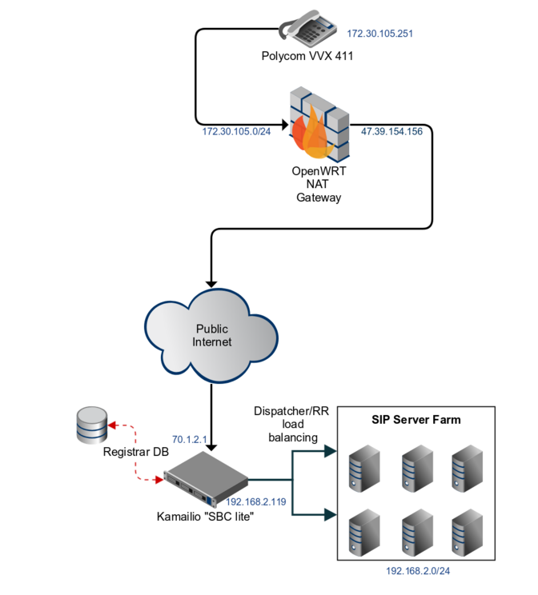
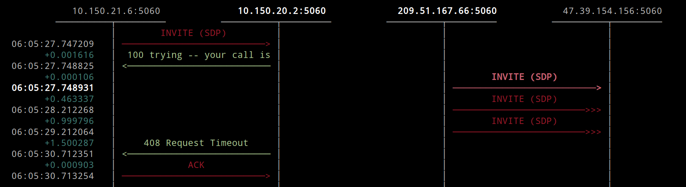

- [راهنمای یکپارچه‌سازی SIP و NAT](#راهنمای-یکپارچهسازی-sip-و-nat)
  - [چرا NAT با SIP مشکل ایجاد می‌کند؟](#چرا-nat-با-sip-مشکل-ایجاد-میکند)
    - [مشکل اول: نحوه کار SIP و RTP و تفاوت آنها با پروتکل های سازگار با NAT](#مشکل-اول-نحوه-کار-sip-و-rtp-و-تفاوت-آنها-با-پروتکل-های-سازگار-با-nat)
    - [مشکل دوم: نیاز به ارتباط دائمی در VoIP](#مشکل-دوم-نیاز-به-ارتباط-دائمی-در-voip)
    - [مشکل سوم: استفاده از UDP در SIP](#مشکل-سوم-استفاده-از-udp-در-sip)
    - [مشکل چهارم: اطلاعات شبکه در پیام‌های SIP](#مشکل-چهارم-اطلاعات-شبکه-در-پیامهای-sip)
    - [مشکل پنجم: طراحی SIP بدون در نظر گرفتن NAT](#مشکل-پنجم-طراحی-sip-بدون-در-نظر-گرفتن-nat)
  - [دو روش اصلی برای عبور از سد NAT](#دو-روش-اصلی-برای-عبور-از-سد-nat)
    - [روش سمت کاربر](#1-روش-سمت-کاربر)
    - [روش سمت سرور](#2-روش-سمت-سرور)
    - [کدام روش بهتر است؟](#کدام-روش-بهتر-است)
  - [رویکرد سمت سرور برای حل مشکل NAT (Server-side NAT traversal)](#رویکرد-سمت-سرور-برای-حل-مشکل-nat-موضوع-server-side-nat-traversal)
    - [چگونه این کار انجام می‌شود؟](#چگونه-این-کار-انجام-میشود)
    - [چرا این روش محبوب است؟](#چرا-این-روش-محبوب-است)
    - [مشکل ترکیب رویکرد سمت کاربر و سمت سرور](#مشکل-ترکیب-رویکرد-سمت-کاربر-و-سمت-سرور)
    - [جمع‌بندی](#جمعبندی)
  - [مشکلات ALG (Application Layer Gateways) و چرا آن‌ها را دوست نداریم!](#مشکلات-alg-application-layer-gateways-و-چرا-آنها-را-دوست-نداریم)
    - [چرا ALGها مشکل‌ساز هستند؟](#چرا-algها-مشکلساز-هستند)
    - [چگونه با ALGها مقابله کنیم؟](#چگونه-با-algها-مقابله-کنیم)
    - [جمع‌بندی](#جمعبندی)
  - [مشکل NAT و انتقال صدا (RTP)](#مشکل-nat-و-انتقال-صدا-rtp)
    - [چرا RTP مهم است؟](#چرا-rtp-مهم-است)
    - [راه‌حل: RTP Latching](#راهحل-rtp-latching)
    - [جمع‌بندی](#جمعبندی)
  - [چه زمانی به RTP Relay نیاز داریم؟](#چه-زمانی-به-rtp-relay-نیاز-داریم)
    - [وقتی RTP Relay لازم نیست](#1-وقتی-rtp-relay-لازم-نیست)
    - [وقتی RTP Relay لازم است](#2-وقتی-rtp-relay-لازم-است)
    - [جمع‌بندی](#جمعبندی)
  - [چرا RTP Engine مهم است؟](#چرا-rtp-engine-مهم-است)
    - [راه‌حل: استفاده از RTPEngine](#راهحل-استفاده-از-rtpengine)
    - [چگونه RTPEngine با Kamailio کار می‌کند؟](#چگونه-rtpengine-با-kamailio-کار-میکند)
    - [جمع‌بندی](#جمعبندی)
  - [مثال عملی: تنظیمات شبکه و دستگاه‌ها](#مثال-عملی-تنظیمات-شبکه-و-دستگاهها)
    - [نقش Kamailio](#نقش-kamailio)
    - [سرورهای رسانه (Media Servers)](#سرورهای-رسانه-media-servers)
    - [جمع‌بندی](#جمعبندی)
  - [ماژول nathelper در Kamailio](#ماژول-nathelper-در-kamailio)
    - [تغییر ویژگی‌های پیام‌های SIP برای سازگاری با NAT](#تغییر-ویژگیهای-پیامهای-sip-برای-سازگاری-با-nat)
    - [تشخیص دستگاه‌های پشت NAT](#تشخیص-دستگاههای-پشت-nat)
    - [ارسال پیام‌های Keepalive به دستگاه‌های پشت NAT](#ارسال-پیامهای-keepalive-به-دستگاههای-پشت-nat)
    - [ارتباط بین nathelper و ماژول ثبت‌کننده (registrar)](#ارتباط-بین-nathelper-و-ماژول-ثبتکننده-registrar)
    - [تابع nat_uac_test()](#تابع-nat_uac_test)
    - [جمع‌بندی](#جمعبندی)
  - [مثال عملی: یک درخواست REGISTER از دستگاه پشت NAT](#مثال-عملی-یک-درخواست-register-از-دستگاه-پشت-nat)
    - [تشخیص دستگاه‌های پشت NAT با nat_uac_test()](#تشخیص-دستگاههای-پشت-nat-با-nat_uac_test)
    - [بحث: تشخیص NAT با استفاده از آدرس‌های خصوصی](#بحث-تشخیص-nat-با-استفاده-از-آدرسهای-خصوصی)
    - [جمع‌بندی](#جمعبندی)
  - [تفاوت بین روش‌های قدیمی و جدید برای حل مشکل NAT در Kamailio](#تفاوت-بین-روشهای-قدیمی-و-جدید-برای-حل-مشکل-nat-در-kamailio)
    - [تابع fix_nated_contact()](#تابع-fix_nated_contact)
    - [تابع fix_nated_register()](#تابع-fix_nated_register)
    - [روش‌های جدید: handle_ruri_alias() و set_contact_alias()](#روشهای-جدید-handle_ruri_alias-و-set_contact_alias)
    - [جمع‌بندی](#جمعبندی)
  - [درک عمیق‌تر کد Kamailio برای مدیریت NAT در تماس‌های SIP](#درک-عمیقتر-کد-kamailio-برای-مدیریت-nat-در-تماسهای-sip)
    - [بخش اول: تشخیص NAT و اجبار استفاده از رپورت](#بخش-اول-تشخیص-nat-و-اجبار-استفاده-از-رپورت)
    - [بخش دوم: مدیریت SDP در تماس‌های INVITE و UPDATE](#بخش-دوم-مدیریت-sdp-در-تماسهای-invite-و-update)
    - [بخش سوم: مدیریت درخواست‌های دعوت (INVITE)](#بخش-سوم-مدیریت-درخواستهای-دعوت-invite)
    - [بخش چهارم: مدیریت درخواست‌های ثبت نام (REGISTER)](#بخش-چهارم-مدیریت-درخواستهای-ثبت-نام-register)
    - [جمع‌بندی](#جمعبندی)
  - [مدیریت سرورهای پشت NAT در محیط‌های ابری](#مدیریت-سرورهای-پشت-nat-در-محیطهای-ابری)
    - [چگونه Kamailio را برای این شرایط تنظیم کنیم؟](#چگونه-kamailio-را-برای-این-شرایط-تنظیم-کنیم)
    - [چرا این تنظیم مهم است؟](#چرا-این-تنظیم-مهم-است)
    - [جمع‌بندی](#جمعبندی)
  - [انتقال صدا بین دو شبکه متفاوت با RTPEngine](#انتقال-صدا-بین-دو-شبکه-متفاوت-با-rtpengine)
    - [چگونه RTPEngine کار می‌کند؟](#چگونه-rtpengine-کار-میکند)
    - [مثال](#مثال)
    - [جمع‌بندی](#جمعبندی)
  - [تعیین جهت جریان صدا در RTPEngine](#تعیین-جهت-جریان-صدا-در-rtpengine)
    - [مدیریت جریان بازگشتی](#مدیریت-جریان-بازگشتی)
    - [جمع‌بندی](#جمعبندی)
  - [چالش‌های NAT و اهمیت حفظ ارتباط در دستگاه‌های SIP](#چالشهای-nat-و-اهمیت-حفظ-ارتباط-در-دستگاههای-sip)
    - [مشکل چیست؟](#مشکل-چیست)
    - [چرا UDP بیشتر تحت تأثیر قرار می‌گیرد؟](#چرا-udp-بیشتر-تحت-تأثیر-قرار-میگیرد)
    - [راه حل: استفاده از Keepalive](#راه-حل-استفاده-از-keepalive)
    - [چرا این موضوع برای دستگاه‌های SIP مهم است؟](#چرا-این-موضوع-برای-دستگاههای-sip-مهم-است)
    - [جمع‌بندی](#جمعبندی)
  - [مشکلات NAT در سیستم‌های تلفنی SIP و راهکارهای آن](#مشکلات-nat-در-سیستمهای-تلفنی-sip-و-راهکارهای-آن)
    - [مشکل اصلی چیست؟](#مشکل-اصلی-چیست)
    - [راه حل اول: کاهش بازه زمانی ثبت‌نام مجدد (re-registration interval)](#راه-حل-اول-کاهش-بازه-زمانی-ثبتنام-مجدد-re-registration-interval)
    - [راه حل دوم: استفاده از پیام‌های Keepalive](#راه-حل-دوم-استفاده-از-پیامهای-keepalive)
    - [مقایسه دو روش](#مقایسه-دو-روش)
    - [کدام روش بهتر است؟](#کدام-روش-بهتر-است)
    - [جمع‌بندی](#جمعبندی)
  - [استفاده از پیام‌های Keepalive در دستگاه‌های کاربران نهایی و پاسخگویی Kamailio](#استفاده-از-پیامهای-keepalive-در-دستگاههای-کاربران-نهایی-و-پاسخگویی-kamailio)
    - [مشکل چیست؟](#مشکل-چیست)
    - [راه حل: استفاده از Keepalive](#راه-حل-استفاده-از-keepalive)
    - [پاسخگویی Kamailio به درخواست‌های Keepalive](#پاسخگویی-kamailio-به-درخواستهای-keepalive)
    - [چرا این روش مفید است؟](#چرا-این-روش-مفید-است)
    - [جمع‌بندی](#جمعبندی)
  - [پاسخگویی به درخواست‌های OPTIONS در Kamailio با در نظر گرفتن جزئیات درخواست](#پاسخگویی-به-درخواستهای-options-در-kamailio-با-در-نظر-گرفتن-جزئیات-درخواست)
    - [مشکل چیست؟](#مشکل-چیست)
    - [راه حل ساده](#راه-حل-ساده)
    - [چرا این روش موثر است؟](#چرا-این-روش-موثر-است)
    - [راه حل دیگر: ارسال Keepalive از سمت سرور](#راه-حل-دیگر-ارسال-keepalive-از-سمت-سرور)
    - [مزایای استفاده از Keepalive](#مزایای-استفاده-از-keepalive)
    - [جمع‌بندی](#جمعبندی)
  - [مشکل قطعه‌بندی UDP در پروتکل SIP و راه حل آن](#مشکل-قطعهبندی-udp-در-پروتکل-sip-و-راه-حل-آن)
    - [مشکل چیست؟](#مشکل-چیست)
    - [چرا قطعه‌بندی UDP مشکل‌ساز است؟](#چرا-قطعهبندی-udp-مشکلساز-است)
    - [راه حل: استفاده از پروتکل TCP](#راه-حل-استفاده-از-پروتکل-tcp)
    - [مزایای استفاده از TCP](#مزایای-استفاده-از-tcp)
    - [جمع‌بندی](#جمعبندی)
  - [مفهوم SIP Outbound: راهکاری برای مدیریت اتصالات SIP در محیط‌های NAT](#مفهوم-sip-outbound-راهکاری-برای-مدیریت-اتصالات-sip-در-محیطهای-nat)
    - [مشکل چیست؟](#مشکل-چیست)
    - [مفهوم SIP Outbound چیست؟](#مفهوم-sip-outbound-چیست)
    - [چگونه کار می‌کند؟](#چگونه-کار-میکند)
    - [چرا SIP Outbound هنوز رایج نیست؟](#چرا-sip-outbound-هنوز-رایج-نیست)
    - [مزایای SIP Outbound](#مزایای-sip-outbound)
    - [معایب SIP Outbound](#معایب-sip-outbound)
    - [چه زمانی از SIP Outbound استفاده کنیم؟](#چه-زمانی-از-sip-outbound-استفاده-کنیم)
    - [نتیجه‌گیری](#نتیجهگیری)

## چرا NAT با SIP مشکل ایجاد می‌کند؟

دلایل اصلی این مشکل به شرح زیر است:

### مشکل اول: نحوه کار SIP و RTP و تفاوت آنها با پروتکل های سازگار با NAT

پروتکل SIP برای برقراری تماس‌های صوتی (VoIP) به کار می‌رود. هنگامی که دو نفر قصد برقراری تماس دارند، SIP ابتدا یک کانال ارتباطی ایجاد می‌کند تا درباره نحوه انتقال جریان‌های صوتی (RTP) توافق کنند. این جریان‌های صوتی روی پورت‌های تصادفی و موقتی برقرار می‌شوند. این نحوه کار شبیه به پروتکل‌هایی مثل FTP است که داده‌ها و اطلاعات کنترلی را روی یک اتصال ثابت ارسال نمی‌کنند، بلکه از اتصالات موقتی روی پورت‌های مختلف استفاده می‌کنند.
در مقابل، پروتکل‌هایی مانند HTTP (که برای مرور وب استفاده می‌شود) تمام داده‌ها را از طریق یک اتصال ثابت ارسال می‌کنند. این ویژگی باعث می‌شود NAT به راحتی بتواند با این پروتکل‌ها کار کند، زیرا تمام ترافیک از یک مسیر مشخص عبور می‌کند. اما در SIP، به دلیل تغییر پورت‌ها به صورت پویا و غیرقابل پیش‌بینی، NAT نمی‌تواند به سادگی این تغییرات را مدیریت کند و در نتیجه مشکلاتی در برقراری تماس ایجاد می‌شود.

### مشکل دوم: نیاز به ارتباط دائمی در VoIP

در تماس‌های صوتی (VoIP)، برخلاف پروتکل‌هایی مانند HTTP که ارتباط‌ها موقتی هستند، دستگاه‌ها باید همیشه قابل دسترس باشند. یعنی نه تنها باید بتوانند تماس برقرار کنند، بلکه باید تماس‌های ورودی را نیز دریافت کنند، حتی اگر برای مدتی طولانی هیچ فعالیتی انجام نشده باشد. این موضوع با پروتکل‌هایی مانند HTTP که ارتباط‌ها کوتاه‌مدت هستند، تفاوت دارد (البته امروزه با فناوری‌هایی مانند WebSockets این تفاوت کمی کمتر شده است).

### مشکل سوم: استفاده از UDP در SIP

بیشتر سیستم‌های SIP از پروتکل UDP استفاده می‌کنند. UDP یک پروتکل بدون اتصال است، یعنی داده‌ها را بدون ایجاد یک ارتباط پایدار ارسال می‌کند. این ویژگی باعث می‌شود NAT (ترجمه آدرس شبکه) نتواند به خوبی با آن کار کند، زیرا NAT باید بتواند جریان‌های داده را شناسایی و مدیریت کند.

مشکل دیگر این است که NAT معمولاً جریان‌های UDP را برای مدت زمان کوتاهی در حافظه نگه می‌دارد (مثلاً فقط یک دقیقه). این باعث می‌شود که اگر ارتباطی برای مدتی غیرفعال باشد، NAT آن را فراموش کند و مشکلاتی در برقراری تماس ایجاد شود. برای حل این مشکل، باید از روش‌هایی مانند ارسال پیام‌های "زنده‌نگه‌دارنده" (keepalive) استفاده کرد.

همچنین، استفاده از UDP ممکن است باعث ایجاد مشکلاتی مانند تقسیم بسته‌های داده (fragmentation) شود. به همین دلیل، برخی پیشنهاد می‌کنند که در لبه شبکه (جایی که کاربران به شبکه متصل می‌شوند) از TCP به جای UDP استفاده شود. اما این کار هم مشکلات خودش را دارد و نمی‌تواند همه مشکلات NAT را حل کند.

### مشکل چهارم: اطلاعات شبکه در پیام‌های SIP

در SIP، دستگاه‌ها اطلاعات شبکه‌ای مانند آدرس IP و پورت را مستقیماً در پیام‌های خود قرار می‌دهند. یعنی یک دستگاه به دستگاه دیگر می‌گوید: «من با این آدرس IP و پورت در دسترس هستم». مشکل اینجاست که اگر دستگاه نتواند آدرس عمومی خود را تشخیص دهد (مثلاً به دلیل وجود NAT)، این اطلاعات اشتباه خواهند بود و دستگاه‌های دیگر نمی‌توانند با آن ارتباط برقرار کنند.

در پروتکل‌های دیگر مانند DNS یا ARP، یک لایه ترجمه وجود دارد که این مشکلات را حل می‌کند، اما SIP چنین مکانیزمی ندارد.

### مشکل پنجم: طراحی SIP بدون در نظر گرفتن NAT

پروتکل SIP در اصل برای شبکه‌هایی طراحی شده بود که در آن‌ها دستگاه‌ها به طور مستقیم و بدون مانع (مانند NAT) می‌توانستند با هم ارتباط برقرار کنند. در واقع، در استاندارد اصلی SIP (RFC 3261) حتی کلمه‌ای به نام NAT وجود ندارد! اما امروزه، به دلیل استفاده گسترده از NAT در شبکه‌های IPv4، این طراحی قدیمی باعث ایجاد مشکلات زیادی شده است.

### جمع‌بندی

به طور خلاصه، SIP با NAT مشکل دارد زیرا:

- نیاز به ارتباط دائمی و قابل دسترس بودن دارد.
- از UDP استفاده می‌کند که با NAT سازگاری کمتری دارد.
- اطلاعات شبکه را مستقیماً در پیام‌ها قرار می‌دهد، بدون اینکه مکانیزمی برای ترجمه آدرس‌ها داشته باشد.
- در اصل برای شبکه‌های بدون NAT طراحی شده بود.

---

## دو روش اصلی برای عبور از سد NAT

وقتی می‌خواهیم دستگاه‌هایی که پشت یک روتر (NAT) قرار دارند با هم ارتباط برقرار کنند، دو راه اصلی پیش رو داریم:

### 1. روش سمت کاربر

در این روش، خود دستگاه‌ها (مثل کامپیوتر یا گوشی شما) تلاش می‌کنند تا آدرس واقعی خودشان را در اینترنت پیدا کنند و به دستگاه‌های دیگر بگویند که کجا هستند. این روش بیشتر در فناوری‌های جدید مثل WebRTC و ICE استفاده می‌شود. پروتکل‌هایی مثل STUN هم به دستگاه‌ها کمک می‌کنند تا آدرسشان را پیدا کنند.

### 2. روش سمت سرور

در این روش، یک سرور واسطه قرار می‌گیرد و ارتباط بین دستگاه‌ها را مدیریت می‌کند. این سرور به عنوان یک پل عمل می‌کند و به دستگاه‌ها کمک می‌کند تا به هم دسترسی پیدا کنند، بدون اینکه نگران پیدا کردن آدرس‌های پیچیده باشند.

**مثال ساده**

تصور کنید شما و دوستتان می‌خواهید با هم تماس تصویری برقرار کنید. هر دوی شما پشت روتر خانه خودتان هستید.

- **روش سمت کاربر**: گوشی شما باید بتواند آدرس اینترنتی خانه‌تان را پیدا کند و به گوشی دوستتان بگوید: «من اینجا هستم».
- **روش سمت سرور**: یک سرور خاص این کار را برای شما انجام می‌دهد. شما و دوستتان به این سرور متصل می‌شوید و سرور ارتباط بین شما را برقرار می‌کند.

**به طور خلاصه**

- **روش سمت کاربر**: دستگاه خودتان مسئولیت حل مشکل را بر عهده می‌گیرد.
- **روش سمت سرور**: یک سرور واسطه، مشکل را حل می‌کند.

### کدام روش بهتر است؟

انتخاب روش مناسب به عوامل مختلفی مثل نوع کاربرد، تعداد کاربران و پیچیدگی شبکه بستگی دارد. هر دو روش مزایا و معایب خود را دارند و در شرایط مختلف از آن‌ها استفاده می‌شود.

---

## رویکرد سمت سرور برای حل مشکل NAT (موضوع Server-side NAT traversal)

در این روش، سرور مسئول حل مشکلات NAT است و دستگاه کاربر (کلاینت) نیازی به انجام کاری ندارد. یعنی سرور باید بتواند آدرس عمومی دستگاه کاربر (WAN) را تشخیص دهد و راه‌هایی برای ارتباط با آن پیدا کند.

### چگونه این کار انجام می‌شود؟

- سرور به آدرس‌ها و پورت‌هایی که دستگاه کاربر در پیام‌های SIP ارسال می‌کند، اعتماد نمی‌کند.
- در عوض، سرور به آدرس و پورتی که واقعاً بسته‌های داده از آن‌جا می‌آیند (یعنی آدرس مبدا در هدر IP) نگاه می‌کند.
- این روش به سرور اجازه می‌دهد تا حتی اگر دستگاه کاربر پشت NAT باشد، بتواند با آن ارتباط برقرار کند.

### چرا این روش محبوب است؟

- **نیاز به تغییر در سمت کاربر ندارد**: دستگاه‌های کاربر نیازی به پیکربندی خاص یا نصب نرم‌افزار اضافی ندارند.
- **راه‌حل جهانی**: این روش تقریباً برای همه دستگاه‌ها کار می‌کند، زیرا سرور همه کارها را انجام می‌دهد.
- **پشتیبانی توسط فروشندگان SBC**: بسیاری از شرکت‌هایی که تجهیزات شبکه (مثل SBC یا Session Border Controller) می‌فروشند، از این روش استفاده می‌کنند.

### مشکل ترکیب رویکرد سمت کاربر و سمت سرور

- معمولاً رویکرد سمت کاربر و سمت سرور با هم سازگار نیستند.
- بیشتر سیستم‌های سمت سرور، دستگاه‌های پشت NAT را با تشخیص تفاوت بین آدرس‌های ارسالی در پیام‌های SIP و آدرس واقعی مبدا شناسایی می‌کنند.
- اگر دستگاه کاربر در شبکه عمومی (بدون NAT) باشد، باز هم ممکن است سرور آن را به اشتباه به عنوان دستگاه پشت NAT تشخیص دهد. در این حالت، سرور باید همه قسمت‌های پیام که حاوی آدرس هستند را اصلاح کند، که این کار می‌تواند پیچیده باشد.

### جمع‌بندی

- **بحث Server-side NAT traversal**: سرور مسئول حل مشکلات NAT است و دستگاه کاربر نیازی به انجام کاری ندارد.
- **مزیت**: این روش برای همه دستگاه‌ها کار می‌کند و نیاز به تغییر در سمت کاربر ندارد.
- **چالش**: ترکیب این روش با رویکرد سمت کاربر می‌تواند مشکل‌ساز باشد.

---

## مشکلات ALG (Application Layer Gateways) و چرا آن‌ها را دوست نداریم!

همان طور که میدانید ALGها نوعی راه‌حل سمت کاربر (Client-side) برای عبور از NAT هستند که درون خود روتر NAT تعبیه شده‌اند. کار آن‌ها این است که آدرس‌های IP و پورت‌های عمومی را در پیام‌های SIP اصلاح کنند تا ارتباطات بهتر کار کنند. اما در عمل، این راه‌حل‌ها بیشتر مشکل‌ساز هستند تا مفید!

### چرا ALGها مشکل‌ساز هستند؟

- میدانیم ALGها معمولاً فقط بخشی از پیام SIP را اصلاح می‌کنند و بقیه قسمت‌ها را نادیده می‌گیرند. مثلاً ممکن است قسمت Via را اصلاح کنند، اما Contact یا SDP را دست نخورده رها کنند. حتی اگر SDP را هم اصلاح کنند، ممکن است پورت‌های لازم برای انتقال صدا (RTP) را باز نکنند.
- این ناقص‌کاری ALGها باعث می‌شود ارتباطات SIP به درستی کار نکنند و مشکلات زیادی ایجاد شود.
- همین مشکلات ممکن است در روش‌های مبتنی بر STUN هم دیده شوند، چون آن‌ها هم از سمت کاربر کار می‌کنند.

### چگونه با ALGها مقابله کنیم؟

**۱. غیرفعال کردن ALG**

اگر از روش‌های سمت سرور (Server-side NAT traversal) استفاده می‌کنید، بهتر است ALG را غیرفعال کنید. برخی روترها این امکان را می‌دهند، اما متأسفانه بسیاری از روترهای معمولی یا مخصوص کسب‌وکارهای کوچک (SMB) این قابلیت را ندارند.

**۲. تعویض روتر**

بهترین راه‌حل این است که روتر NAT خود را با یک روتر بهتر جایگزین کنید.

**۳. استفاده از پورت‌های غیراستاندارد**

اگر نمی‌توانید ALG را غیرفعال کنید، می‌توانید از پورت‌های غیراستاندارد (غیر از 5060) برای SIP استفاده کنید. اما برخی روترها هوشمند هستند و حتی اگر پورت تغییر کند، باز هم پیام‌های SIP را تشخیص می‌دهند و در آن‌ها دخالت می‌کنند!

### جمع‌بندی

- اگر از روش‌های سمت سرور برای عبور از NAT استفاده می‌کنید، باید هرگونه راه‌حل سمت کاربر (مثل STUN و ALG) را غیرفعال کنید.
- در این روش، نادیده گرفتن آدرس‌های عمومی توسط دستگاه کاربر یک مزیت است، نه یک مشکل! چون سرور همه کارها را انجام می‌دهد و دستگاه کاربر نیازی به دخالت ندارد.

---

## مشکل NAT و انتقال صدا (RTP)

وقتی از روش‌های سمت سرور (Server-side NAT traversal) برای عبور از NAT استفاده می‌کنیم، فقط حل مشکل SIP کافی نیست. باید راه‌حلی برای انتقال صدا (RTP) هم داشته باشیم.

### چرا RTP مهم است؟

- حتی اگر SIP به درستی کار کند و پیام‌ها به مقصد برسند، این به تنهایی برای برقراری تماس صوتی کافی نیست.
- دستگاه‌های پشت NAT صدا (RTP) را از پورتی که در پیام SDP مشخص کرده‌اند ارسال می‌کنند، اما NAT این پورت را به یک پورت دیگر تغییر می‌دهد.
- این یعنی اگر سرور نتواند پورت صحیح را تشخیص دهد، صدا به درستی منتقل نمی‌شود.

### راه‌حل: RTP Latching

برای حل این مشکل، از روشی به نام RTP Latching استفاده می‌شود. این روش به این صورت کار می‌کند:

1. دستگاه مقصد (مثلاً سرور) به پورتی که در پیام SDP اعلام شده است گوش می‌دهد و منتظر دریافت اولین بسته RTP می‌ماند.
2. وقتی اولین بسته RTP دریافت می‌شود، دستگاه مقصد آدرس IP و پورت مبدا را از آن بسته استخراج می‌کند.
3. سپس از همین آدرس و پورت برای ارسال صدا به دستگاه مبدا استفاده می‌کند.

به این ترتیب، حتی اگر NAT پورت را تغییر داده باشد، دستگاه مقصد می‌تواند مسیر صحیح را تشخیص دهد و صدا به درستی منتقل شود.

### جمع‌بندی

- برای عبور از NAT، فقط حل مشکل SIP کافی نیست؛ باید مشکل انتقال صدا (RTP) را هم حل کنید.
- RTP Latching یک روش هوشمندانه است که به دستگاه‌ها کمک می‌کند مسیر صحیح انتقال صدا را تشخیص دهند، حتی اگر NAT پورت‌ها را تغییر داده باشد.

---

## چه زمانی به RTP Relay نیاز داریم؟

وقتی از Kamailio (یک سرور SIP) استفاده می‌کنید، ممکن است نیاز به یک RTP Relay (رله RTP) برای انتقال صدا داشته باشید. اما این نیاز به شرایط و سناریوهای مختلف بستگی دارد.

### ۱. وقتی RTP Relay لازم نیست

- اگر در سمت دیگر Kamailio یک سیستم مثل Asterisk داشته باشید که بتواند به درستی با NAT کار کند (مثلاً با گزینه `nat=yes`)، دیگر نیازی به RTP Relay نیست. Asterisk می‌تواند خودش مسیر انتقال صدا را مدیریت کند.
- همچنین، اگر شما خدمات SIP Trunking به PBXهای پشت NAT ارائه می‌دهید (به جای خدمات Hosted PBX به تلفن‌ها)، ممکن است بتوانید با تنظیم DNAT روی روتر NAT، یک محدوده از پورت‌های RTP را به یک دستگاه خاص در شبکه داخلی منتقل کنید. این روش زمانی کار می‌کند که مقصد صدا ثابت و مشخص باشد. بسیاری از مشتریان از این روش با موفقیت استفاده می‌کنند.

### ۲. وقتی RTP Relay لازم است

- اگر سرویس‌دهنده‌های شما (مثلاً شرکت‌های مخابراتی) پشت Kamailio باشند و سیستم‌های آن‌ها برای کار با NAT پیکربندی نشده باشند، به RTP Relay نیاز دارید. این معمولاً به دلیل سیاست‌های فنی آن‌ها است، نه محدودیت‌های تکنولوژی.
- همچنین، اگر مقصد نهایی صدا در یک شبکه خصوصی باشد (مثلاً در شبکه‌های داخلی سازمانی)، باید از RTP Relay برای انتقال صدا بین شبکه‌ها استفاده کنید.

### جمع‌بندی

- نیاز به RTP Relay به شرایط شبکه و نوع سرویس‌هایی که ارائه می‌دهید بستگی دارد.
- اگر سیستم‌های شما بتوانند به درستی با NAT کار کنند (مثل Asterisk)، ممکن است نیازی به RTP Relay نباشد.
- اما اگر مقصد صدا در شبکه‌های خصوصی باشد یا سرویس‌دهنده‌های شما از NAT پشتیبانی نکنند، استفاده از RTP Relay ضروری است.

---

## چرا RTP Engine مهم است؟

اگر همه مشتریان شما پشت NAT باشند، قرار گرفتن در مسیر انتقال صدا (RTP) می‌تواند تأثیر زیادی روی سخت‌افزار و پهنای باند مورد نیاز شما بگذارد. این موضوع از نظر اقتصادی بسیار مهم است، زیرا ممکن است نیاز به منابع بیشتری داشته باشید.

### راه‌حل: استفاده از RTPEngine

برای مدیریت انتقال صدا (RTP)، ابزاری به نام **RTPEngine** (توسط شرکت Sipwise توسعه داده شده) بسیار محبوب است. این ابزار یک رله RTP بسیار قدرتمند است که می‌تواند صدا را با سرعت نزدیک به سرعت واقعی شبکه (wire speed) منتقل کند. دلیل این سرعت بالا این است که RTPEngine کار انتقال داده‌ها را در فضای هسته (kernel space) سیستم عامل انجام می‌کند.

- **نصب و راه‌اندازی**: نصب و تنظیم RTPEngine کمی پیچیده است و در اینجا به آن پرداخته نمی‌شود، اما می‌توانید از مستندات موجود در صفحه GitHub آن کمک بگیرید.

### چگونه RTPEngine با Kamailio کار می‌کند؟

میدانیم RTPEngine یک فرآیند خارجی است که توسط Kamailio از طریق یک سوکت کنترل UDP مدیریت می‌شود. نحوه کار آن به این صورت است:

1. وقتی Kamailio یک پیام SDP (که حاوی اطلاعات صدا است) دریافت می‌کند، آن را به RTPEngine ارسال می‌کند.
2. در اینجا RTPEngine یک جفت پورت برای RTP و RTCP باز می‌کند تا ترافیک صدا را از دستگاه مبدا دریافت کند.
3. همین فرآیند برای دستگاه مقصد نیز تکرار می‌شود.
4. سپس RTPEngine آدرس‌ها و پورت‌های جدید را در پیام SDP جایگزین می‌کند و آن را به مقصد ارسال می‌کند.
5. در نهایت، RTPEngine در مسیر هر دو جریان صدا (از مبدا به مقصد و برعکس) قرار می‌گیرد و انتقال صدا را مدیریت می‌کند.

### جمع‌بندی

- اگر مشتریان شما پشت NAT باشند، استفاده از ابزاری مثل RTPEngine برای مدیریت انتقال صدا ضروری است.
- RTPEngine با Kamailio همکاری می‌کند و به‌صورت خودکار مسیر انتقال صدا را تنظیم می‌کند.
- این ابزار به دلیل عملکرد در فضای هسته، سرعت بسیار بالایی دارد و برای شبکه‌های بزرگ ایده‌آل است.

---

## مثال عملی: تنظیمات شبکه و دستگاه‌ها

برای اینکه بهتر موضوع را درک کنید، از یک مثال واقعی استفاده می‌کنم. در این مثال، از یک تلفن **Polycom VVX 411** در شبکه خانگی خودم استفاده می‌کنم. این تلفن در شبکه محلی (LAN) با محدوده IP `172.30.105.0/24` قرار دارد.



### نقش Kamailio

- این تلفن با یک سرور Kamailio که آدرس IP آن `70.1.2.1` است، ارتباط برقرار می‌کند.
- سرور Kamailio در اینجا دو نقش مهم دارد:
  1. به عنوان **ثبت‌کننده (Registrar)** عمل می‌کند، یعنی اطلاعات تماس تلفن‌ها را ثبت و مدیریت می‌کند.
  2. به عنوان یک **پل ارتباطی** بین شبکه‌های مختلف عمل می‌کند.

### سرورهای رسانه (Media Servers)

- سرور Kamailio به یک گروه از سرورهای رسانه (Media Servers) متصل است که در یک شبکه خصوصی با محدوده IP `192.168.2.0/24` قرار دارند.
- این سرورها وظیفه مدیریت انتقال صدا (RTP) را بر عهده دارند. Kamailio با استفاده از **RTPEngine**، صدا را بین شبکه‌های مختلف منتقل می‌کند.

**چرا این تنظیمات پیچیده است؟**

- در این مثال، Kamailio نه تنها SIP را مدیریت می‌کند، بلکه صدا (RTP) را نیز بین دو شبکه متفاوت منتقل می‌کند.
- این تنظیمات ممکن است کمی پیچیده به نظر برسد، اما به خوبی نشان می‌دهد که Kamailio چگونه می‌تواند در سناریوهای مختلف استفاده شود.
- این مثال به ما کمک می‌کند تا بفهمیم Kamailio چقدر انعطاف‌پذیر است و چگونه می‌تواند در شبکه‌های پیچیده کار کند.

### جمع‌بندی

- در این مثال، یک تلفن Polycom در شبکه محلی با Kamailio ارتباط برقرار می‌کند.
- سرور Kamailio هم به عنوان ثبت‌کننده و هم به عنوان پل ارتباطی بین شبکه‌های مختلف عمل می‌کند.
- این مثال نشان می‌دهد که Kamailio چطور می‌تواند در شبکه‌های پیچیده استفاده شود و هم SIP و هم RTP را مدیریت کند.

---

## ماژول nathelper در Kamailio

ماژول **nathelper** در Kamailio یک ابزار همه‌کاره برای حل مشکلات مربوط به عبور از NAT است. این ماژول سه وظیفه اصلی دارد:

### ۱. تغییر ویژگی‌های پیام‌های SIP برای سازگاری با NAT

- این ماژول می‌تواند بخش‌هایی از پیام‌های SIP را تغییر دهد تا دستگاه‌های پشت NAT بتوانند به درستی با شبکه خارجی ارتباط برقرار کنند.
- مثلاً آدرس‌ها و پورت‌هایی که در پیام‌های SIP وجود دارند را اصلاح می‌کند.

### ۲. تشخیص دستگاه‌های پشت NAT

- ماژول **nathelper** می‌تواند تشخیص دهد که آیا یک دستگاه پشت NAT قرار دارد یا نه.
- این کار با استفاده از تابع `nat_uac_test()` انجام می‌شود. این تابع چندین تست مختلف را روی دستگاه انجام می‌دهد تا وضعیت NAT را بررسی کند.

### ۳. ارسال پیام‌های Keepalive به دستگاه‌های پشت NAT

- دستگاه‌های پشت NAT ممکن است پس از مدتی غیرفعال بودن، ارتباط خود را از دست بدهند.
- ماژول **nathelper** با ارسال پیام‌های **Keepalive** (پیام‌های زنده‌نگه‌دارنده) به این دستگاه‌ها، ارتباط آن‌ها را فعال نگه می‌دارد.

### ارتباط بین nathelper و ماژول ثبت‌کننده (registrar)

- ماژول **nathelper** و ماژول ثبت‌کننده (registrar) از یک پارامتر مشترک به نام `received_avp` استفاده می‌کنند.
- این پارامتر به Kamailio کمک می‌کند تا اطلاعات مربوط به آدرس و پورت دستگاه‌های پشت NAT را ذخیره و مدیریت کند.

### تابع nat_uac_test()

- این تابع برای تشخیص دستگاه‌های پشت NAT استفاده می‌شود.
- شما می‌توانید با استفاده از یک **bitmask** (ماسک بیتی)، ترکیبی از تست‌ها را انتخاب کنید.
- اگر با مفهوم bitmask آشنا نیستید، به زبان ساده یعنی شما می‌توانید چندین گزینه را با جمع کردن اعداد آن‌ها انتخاب کنید. مثلاً اگر بخواهید از تست‌های ۱ و ۲ استفاده کنید، عدد ۳ را به تابع می‌دهید (چون ۱ + ۲ = ۳).

### جمع‌بندی

- ماژول **nathelper** در Kamailio سه وظیفه اصلی دارد:
  1. اصلاح پیام‌های SIP برای سازگاری با NAT.
  2. تشخیص دستگاه‌های پشت NAT.
  3. ارسال پیام‌های Keepalive برای نگه‌داشتن ارتباط.
- این ماژول با ماژول ثبت‌کننده (registrar) همکاری می‌کند تا اطلاعات دستگاه‌های پشت NAT را مدیریت کند.
- تابع `nat_uac_test()` برای تشخیص دستگاه‌های پشت NAT استفاده می‌شود و از **bitmask** برای انتخاب تست‌ها استفاده می‌کند.

---

## مثال عملی: یک درخواست REGISTER از دستگاه پشت NAT

در اینجا یک درخواست **REGISTER** از یک دستگاه پشت NAT (تلفن Polycom) را بررسی می‌کنیم. این درخواست به سرور Kamailio ارسال شده است.

```plaintext
2018/05/07 06:53:26.402531 47.39.154.156:5060 -> 192.168.2.220:5060
REGISTER sip:sip.evaristesys.com SIP/2.0
Via: SIP/2.0/UDP 172.30.105.251:5060;branch=z9hG4bKffe427d2756F1643
From: "alex-balashov" <sip:alex-balashov@sip.evaristesys.com>;tag=B84E1216-803F7CD7
To: <sip:alex-balashov@sip.evaristesys.com>
CSeq: 3561 REGISTER
Call-ID: 4ae7899d1cc396640e440df7c72662d3
Contact: <sip:alex-balashov@172.30.105.251:5060>;methods="INVITE, ACK, BYE, CANCEL, OPTIONS, INFO, MESSAGE, SUBSCRIBE, NOTIFY, PRACK, UP
TE, REFER"
User-Agent: PolycomVVX-VVX_411-UA/5.6.0.17325
Accept-Language: en
Authorization: [omitted]
Max-Forwards: 70
Expires: 300
Content-Length: 0
```
**جزئیات درخواست**

- **آدرس مبدا**: دستگاه در شبکه داخلی با آدرس `172.30.105.251:5060` قرار دارد، اما درخواست از آدرس عمومی `47.39.154.156:5060` ارسال شده است.
- **هدر Via**: این هدر مشخص می‌کند که پاسخ‌ها به کجا ارسال شوند. در اینجا، هدر Via حاوی آدرس داخلی دستگاه (`172.30.105.251:5060`) است، اما در واقع درخواست از آدرس عمومی (`47.39.154.156:5060`) ارسال شده است.
- **اتفاقی بودن پورت 5060**: اینکه پورت داخلی و خارجی هر دو `5060` هستند، صرفاً یک اتفاق است و معمولاً NAT پورت‌ها را به صورت تصادفی تغییر می‌دهد.

### تشخیص دستگاه‌های پشت NAT با nat_uac_test()

برای تشخیص اینکه دستگاه پشت NAT است، می‌توانیم از تابع `nat_uac_test()` در Kamailio استفاده کنیم.  
در این مثال، اگر از پرچم‌های `۲` و `۱۶` استفاده کنیم، این تابع متوجه می‌شود که آدرس در هدر Via با آدرس واقعی مبدا متفاوت است و نتیجه می‌گیرد که دستگاه پشت NAT قرار دارد.

### بحث: تشخیص NAT با استفاده از آدرس‌های خصوصی

- یک روش ساده برای تشخیص NAT این است که ببینیم آیا آدرس‌های خصوصی (مثل `192.168.x.x`، `172.16.x.x`، یا `10.x.x.x`) در هدر Via یا Contact وجود دارند یا نه.
- اما این روش همیشه جواب نمی‌دهد. مثلاً در شبکه‌هایی که Kamailio هم به شبکه خصوصی و هم به شبکه عمومی متصل است (multihomed)، ممکن است دستگاه‌هایی با آدرس خصوصی مستقیماً قابل دسترسی باشند و نیازی به NAT نداشته باشند.
- بنابراین، بهتر است به جای تکیه بر آدرس‌های خصوصی، به تفاوت بین آدرس و پورت واقعی مبدا و آدرس و پورتی که در پیام SIP مشخص شده است، توجه کنیم. این روش دقیق‌تر و قابل اعتمادتر است.

### جمع‌بندی

- برای تشخیص دستگاه‌های پشت NAT، می‌توانیم از تابع `nat_uac_test()` در Kamailio استفاده کنیم.
- استفاده از پرچم‌های `۲` و `۱۶` به ما کمک می‌کند تا تفاوت بین آدرس واقعی مبدا و آدرس ذکر شده در پیام SIP را تشخیص دهیم.
- روش تشخیص NAT بر اساس آدرس‌های خصوصی ممکن است همیشه جواب ندهد، بنابراین بهتر است به تفاوت بین آدرس واقعی و آدرس ذکر شده توجه کنیم.

---

## تفاوت بین روش‌های قدیمی و جدید برای حل مشکل NAT در Kamailio

در گذشته، برای حل مشکلات NAT در Kamailio (یا OpenSER، نسخه قدیمی‌تر Kamailio)، از دو تابع `fix_nated_contact()` و `fix_nated_register()` استفاده می‌شد. این توابع هنوز هم در بسیاری از کتاب‌ها و مستندات قدیمی دیده می‌شوند، اما روش‌های جدیدتری وجود دارند که بهتر و کم‌تهاجمی‌تر هستند.

### تابع fix_nated_contact()

- این تابع بخش دامنه (domain) در آدرس Contact URI را تغییر می‌دهد و آن را با آدرس IP و پورت واقعی مبدا جایگزین می‌کند.
- مشکل این تابع این است که Contact URI را تغییر می‌دهد، در حالی که استاندارد SIP (RFC 3261) می‌گوید این کار نباید انجام شود. این تغییرات می‌توانند باعث ایجاد مشکلاتی در ارتباطات SIP شوند.

### تابع fix_nated_register()

- این تابع مخصوص درخواست‌های **REGISTER** است و فقط زمانی مفید است که Kamailio به عنوان ثبت‌کننده (registrar) عمل کند یا درخواست‌های ثبت را به جای دیگری ارسال کند.
- این تابع آدرس IP و پورت واقعی مبدا را در یک متغیر به نام `received_avp` ذخیره می‌کند. سپس این اطلاعات می‌توانند توسط ماژول ثبت‌کننده استفاده شوند تا پاسخ‌ها به آدرس صحیح ارسال شوند.
- این تابع نسبت به `fix_nated_contact()` کمتر مشکل‌ساز است، اما همچنان نیاز به هماهنگی با ماژول ثبت‌کننده دارد.

### روش‌های جدید: handle_ruri_alias() و set_contact_alias()

به جای توابع قدیمی، Kamailio توابع جدیدی مانند `handle_ruri_alias()` و `set_contact_alias()` ارائه می‌دهد که بهتر و کم‌تهاجمی‌تر هستند.

**چگونه کار می‌کنند؟**

- این توابع به جای تغییر مستقیم Contact URI، یک پارامتر **alias** به آن اضافه می‌کنند. مثلاً:
  - `Contact: <sip:alex-balashov@172.30.105.251:5060>`
  - به این شکل تغییر می‌کند:
  - `Contact: <sip:alex-balashov@172.30.105.251:5060;alias=47.39.154.156~5060~1>`
- این پارامتر **alias** حاوی آدرس IP و پورت واقعی مبدا است.
- وقتی تابع `handle_ruri_alias()` فراخوانی می‌شود، این پارامتر از Contact URI حذف می‌شود و اطلاعات آن برای ارسال پاسخ‌ها استفاده می‌شود.
- اگر پارامتر **alias** وجود نداشته باشد، تابع `handle_ruri_alias()` به سادگی بدون خطا کار خود را ادامه می‌دهد. این ویژگی باعث می‌شود کد شما ساده‌تر و قابل اعتمادتر شود.

### جمع‌بندی

- توابع قدیمی `fix_nated_contact()` و `fix_nated_register()` مشکلاتی دارند و ممکن است با استانداردهای SIP سازگار نباشند.
- توابع جدید مانند `handle_ruri_alias()` و `set_contact_alias()` بهتر هستند، چون کم‌تهاجمی‌تر بوده و مشکلات کمتری ایجاد می‌کنند.
- توصیه می‌شود از این توابع جدید به جای توابع قدیمی استفاده کنید تا کد شما ساده‌تر و مطمئن‌تر باشد.

---

## درک عمیق‌تر کد Kamailio برای مدیریت NAT در تماس‌های SIP

کد ارائه شده بخشی حیاتی از یک سرور Kamailio است که برای مدیریت تماس‌های SIP در محیط‌هایی که NAT وجود دارد، طراحی شده است. بیایید به طور دقیق‌تر هر بخش از کد و عملکرد آن را بررسی کنیم:

### بخش اول: تشخیص NAT و اجبار استفاده از رپورت
در ابتدای `request_route`، معمولاً یک subroutine جهانی قرار می‌دهیم که بررسی می‌کند آیا درخواست از یک شبکه‌ی پشتNAT  آمده است یا خیر. این بررسی باید قبل از هرگونه بررسی احراز هویت (authentication/AAA) انجام شود، زیرا پاسخ‌هایی مانند 401/407 (چالش‌های احراز هویت) و سایر پاسخ‌ها باید به مکان صحیحی ارسال شوند. این کار با استفاده از تابع `force_rport()` انجام می‌شود.

```c
if(nat_uac_test("18")) {
   force_rport();

   if(is_method("INVITE|REGISTER|SUBSCRIBE"))
      set_contact_alias();
}
```

* متد **`nat_uac_test("18")`:** این تابع بررسی می‌کند که آیا درخواست از یک دستگاه پشت NAT آمده است یا خیر. عدد "18" به یک نوع خاص از NAT اشاره دارد که معمولاً در شبکه‌های خانگی و اداری استفاده می‌شود.
* متد **`force_rport()`:** اگر درخواست از پشت NAT آمده باشد، این تابع باعث می‌شود که آدرس IP محلی در هدر Contact قرار داده شود. این کار به سرور کمک می‌کند تا پاسخ‌ها را به درستی به دستگاه پشت NAT ارسال کند.
* متد **`set_contact_alias()`:** اگر درخواست از نوع `INVITE`، `REGISTER` یا `SUBSCRIBE` باشد، این تابع فراخوانی می‌شود. این تابع آدرس `Contact` در درخواست SIP را به‌روزرسانی می‌کند تا مطمئن شود که پاسخ‌ها به درستی به کلاینت پشت NAT ارسال می‌شوند.

### بخش دوم: مدیریت SDP در تماس‌های INVITE و UPDATE
در بخش `loose_route()` که مسئول مدیریت درخواست‌های re-invite و سایر درخواست‌های درون دیالوگ (in-dialog) است، باید RTPEngine را فعال کنید و هرگونه `;alias` موجود در URI درخواست را مدیریت کنید.

```c
if(has_totag()) {
   if(loose_route()) {
      if(is_method("INVITE|UPDATE") && sdp_content() && nat_uac_test("18"))
         rtpengine_manage("replace-origin replace-session-connection ICE=remove");
      ...
   }
}
```

* متد **`has_totag()`**: این خط بررسی می‌کند آیا درخواست SIP دارای تگ`To`است یا خیر. وجود تگ`To` نشان‌دهنده‌ی این است که درخواست بخشی از یک دیالوگ (مکالمه) SIP است.
* متد **`rtpengine_manage()`:** این تابع برای مدیریت اطلاعات SDP استفاده می‌شود. پارامترهای این تابع به Kamailio می‌گویند که چه تغییراتی را در اطلاعات SDP اعمال کند. در این مثال، آدرس IP و پورت‌های موجود در SDP تغییر می‌کنند تا با محیط NAT سازگار شوند.
* متد **`loose_route()`**: این خط بررسی می‌کند آیا درخواست باید به صورت `loose routing` مسیریابی شود یا خیر. `loose routing` یک روش مسیریابی در پروتکل SIP است که برای مدیریت درخواست‌های درون دیالوگ استفاده می‌شود.
* خط **`if(is_method("INVITE|UPDATE") && sdp_content() && nat_uac_test("18"))`**: این خط بررسی می‌کند آیا درخواست از نوع `INVITE` یا `UPDATE` است و آیا محتوای SDP در درخواست وجود دارد یا خیر. همچنین بررسی می‌کند آیا کلاینت پشت NAT است یا خیر.اگر همه‌ی این شرایط برقرار باشند، تابع `rtpengine_manage` فراخوانی می‌شود.
* متد **`rtpengine_manage("replace-origin replace-session-connection ICE=remove")`**: این تابع RTPEngine را فعال می‌کند تا جریان‌های رسانه‌ای (RTP) را مدیریت کند. پارامترهای `replace-origin` و `replace-session-connection` باعث می‌شوند که آدرس‌های IP و پورت‌های موجود در SDP به‌روزرسانی شوند. پارامتر `ICE=remove` نیز باعث حذف اطلاعات ICE (Interactive Connectivity Establishment) از SDP می‌شود.
* متد **`handle_ruri_alias()`**: این تابع هرگونه `;alias` موجود در URI درخواست را مدیریت می‌کند. `;alias` معمولاً برای مدیریت آدرس‌های NAT شده استفاده می‌شود.
* متد **`t_on_reply("MAIN_REPLY")`**: این خط یک رویداد (event) تعریف می‌کند که وقتی پاسخ SIP دریافت شد، تابع `MAIN_REPLY` فراخوانی شود. این کار برای مدیریت پاسخ‌های SIP استفاده می‌شود.
* خط **`if(!t_relay())`**: این خط درخواست SIP را به مقصد بعدی ارسال (relay) می‌کند. اگر ارسال موفقیت‌آمیز نباشد، کد داخل بلوک `if` اجرا می‌شود.
* متد **`sl_reply_error()`**: اگر ارسال درخواست با خطا مواجه شود، این تابع یک پاسخ خطای SIP ارسال می‌کند.
* خط **`exit`**: این دستور باعث خروج از اسکریپت می‌شود و از ادامه‌ی اجرای کد جلوگیری می‌کند.

### بخش سوم: مدیریت درخواست‌های دعوت (INVITE)
مدیریت درخواست‌های `INVITE` اولیه نیز مشابه است:

```c
request_route {
   ...

   if(has_totag()) {
      ...
   }

   ...

   t_check_trans();

   if(is_method("INVITE")) {
      if(nat_uac_test("18") && sdp_content()) 
         rtpengine_manage("replace-origin replace-session-connection ICE=remove");

      t_on_reply("MAIN_REPLY");

      if(!t_relay())
         sl_reply_error();

      exit;
   }
}
```

* متد **`t_check_trans()`**: این تابع بررسی می‌کند آیا درخواست SIP بخشی از یک تراکنش (transaction) موجود است یا خیر. اگر باشد، تراکنش مربوطه را مدیریت می‌کند.
* خط **`if(is_method("INVITE"))`**: این خط بررسی می‌کند آیا درخواست از نوع `INVITE` است یا خیر.
* خط **`if(nat_uac_test("18") && sdp_content())`**: این خط بررسی می‌کند آیا کلاینت پشت NAT است و آیا محتوای SDP در درخواست وجود دارد یا خیر.
* متد **`rtpengine_manage("replace-origin replace-session-connection ICE=remove")`**: اگر شرایط فوق برقرار باشند، این تابع RTPEngine را فعال می‌کند تا جریان‌های رسانه‌ای (RTP) را مدیریت کند.
* متد **`t_on_reply("MAIN_REPLY")`**: این خط یک رویداد (event) تعریف می‌کند که وقتی پاسخ SIP دریافت شد، تابع `MAIN_REPLY` فراخوانی شود.
* خط **`if(!t_relay())`**: این خط درخواست SIP را به مقصد بعدی ارسال (relay) می‌کند. اگر ارسال موفقیت‌آمیز نباشد، کد داخل بلوک `if` اجرا می‌شود.
* متد **`sl_reply_error()`**: اگر ارسال درخواست با خطا مواجه شود، این تابع یک پاسخ خطای SIP ارسال می‌کند.
* خط **`exit`**: این دستور باعث خروج از اسکریپت می‌شود و از ادامه‌ی اجرای کد جلوگیری می‌کند.

### بخش چهارم
برای مدیریت مواردی که درخواست‌ها به یک نقطه‌ی پایانی NAT شده ارسال می‌شوند یا زمانی که نقاط پایانی NAT شده مستقیماً با یکدیگر تماس می‌گیرند، باید یک `onreply_route` برای هر تراکنشی که شامل یک طرف NAT شده است، تعریف شود. منطق آن باید مشابه باشد.

```c
onreply_route[MAIN_REPLY] {
   if(nat_uac_test("18")) {
      force_rport();
      set_contact_alias();

      if(sdp_content()) 
         rtpengine_manage("replace-origin replace-session-connection ICE=remove");
    }
}
```
* خط **`if(nat_uac_test("18"))`**: این خط بررسی می‌کند آیا پاسخ SIP از یک کلاینت NAT شده (UAC) آمده است یا خیر.
* متد **`force_rport()`**: این تابع باعث می‌شود که سرور SIP، پورت و آدرس IP واقعی کلاینت را در هدر `Via` پاسخ SIP ذخیره کند.
* متد **`set_contact_alias()`**: این تابع آدرس `Contact` در پاسخ SIP را به‌روزرسانی می‌کند تا مطمئن شود که پاسخ‌ها به درستی به کلاینت پشت NAT ارسال می‌شوند.
* خط **`if(sdp_content())`**: این خط بررسی می‌کند آیا محتوای SDP در پاسخ SIP وجود دارد یا خیر.
* متد **`rtpengine_manage("replace-origin replace-session-connection ICE=remove")`**: اگر محتوای SDP وجود داشته باشد، این تابع موتور RTP (RTPEngine) را فعال می‌کند تا جریان‌های رسانه‌ای (RTP) را مدیریت کند.

### بخش پنجم: مدیریت درخواست‌های ثبت نام (REGISTER)
درخواست‌های ثبت‌نام (registration) توسط بخش کلی تشخیص NAT که در بالا توضیح داده شد، مدیریت می‌شوند. با این حال، جستجوهای ثبت‌نام (registration lookups) نیاز به یک نکته‌ی اضافی دارند.

```c
route[REGISTRAR_LOOKUP] {
   ...

   if(!lookup("location")) {
      sl_send_reply("404", "Not Found");
      exit;
   }

   handle_ruri_alias();

   if(!t_relay())
      sl_reply_error();

   exit;
}
```
* خط **`if(!lookup("location"))`**: این خط بررسی می‌کند آیا جستجو در جدول `location` موفقیت‌آمیز بوده است یا خیر. اگر جستجو ناموفق باشد، کد داخل بلوک `if` اجرا می‌شود.
* متد **`sl_send_reply("404", "Not Found")`**: اگر جستجو ناموفق باشد، این تابع یک پاسخ SIP با کد وضعیت `404` (یافت نشد) ارسال می‌کند.
* خط **`exit`**: این دستور باعث خروج از اسکریپت می‌شود و از ادامه‌ی اجرای کد جلوگیری می‌کند.
* متد **`handle_ruri_alias()`**: این تابع هرگونه `;alias` موجود در URI درخواست را مدیریت می‌کند.
* خط **`if(!t_relay())`**: این خط درخواست SIP را به مقصد بعدی ارسال (relay) می‌کند. اگر ارسال موفقیت‌آمیز نباشد، کد داخل بلوک `if` اجرا می‌شود.
* متد **`sl_reply_error();`**: اگر ارسال درخواست با خطا مواجه شود، این تابع یک پاسخ خطای SIP ارسال می‌کند.
* خط **`exit;`**: این دستور باعث خروج از اسکریپت می‌شود و از ادامه‌ی اجرای کد جلوگیری می‌کند.

### جمع‌بندی:
این کدها برای مدیریت درخواست‌های SIP در شبکه‌هایی که از NAT استفاده می‌کنند، طراحی شده‌اند. بخش اول کد، بررسی می‌کند آیا کلاینت پشت NAT است و اگر باشد، تنظیمات لازم برای مسیریابی صحیح پاسخ‌ها را انجام می‌دهد. بخش دوم کد، درخواست‌های درون دیالوگ (مانند `re-INVITE`) را مدیریت می‌کند و از RTPEngine برای مدیریت جریان‌های رسانه‌ای استفاده می‌کند. همچنین، هرگونه `;alias` در URI درخواست را مدیریت می‌کند تا اطمینان حاصل شود که درخواست‌ها و پاسخ‌ها به درستی مسیریابی می‌شوند.

---

## مدیریت سرورهای پشت NAT در محیط‌های ابری

فرض کنید شما یک سرور دارید که در یک محیط ابری قرار گرفته است. این سرور یک آدرس خصوصی دارد که فقط در داخل شبکه ابری قابل دسترسی است، اما همچنین یک آدرس عمومی نیز به آن اختصاص داده شده است تا بتوان از خارج از شبکه نیز به آن دسترسی پیدا کرد.

### چگونه Kamailio را برای این شرایط تنظیم کنیم؟

می دانیم Kamailio یک نرم‌افزار برای مدیریت تماس‌های تلفنی از طریق اینترنت است. برای اینکه Kamailio بتواند به درستی با دنیای خارج ارتباط برقرار کند، باید به آن بگوییم که آدرس عمومی سرور چیست. این کار با استفاده از یک تنظیم خاص به نام "advertise" انجام می‌شود.

**مثال:**

```plaintext
listen=udp:192.168.2.119:5060 advertise 70.1.2.1:5060
```

در این مثال:
* **192.168.2.119:** آدرس خصوصی سرور است.
* **70.1.2.1:** آدرس عمومی سرور است.

وقتی Kamailio پیامی را ارسال می‌کند، به جای استفاده از آدرس خصوصی، از آدرس عمومی در پیام‌ها استفاده می‌کند. این کار باعث می‌شود که دستگاه‌های دیگر بتوانند به راحتی با سرور ارتباط برقرار کنند.

### چرا این تنظیم مهم است؟

اگر Kamailio از آدرس خصوصی خود استفاده کند، دستگاه‌های خارج از شبکه قادر نخواهند بود با آن ارتباط برقرار کنند.

**توجه:**

* این تنظیم فقط برای آدرس‌هایی که در پیام‌های SIP استفاده می‌شوند کاربرد دارد.
* برای مدیریت جریان‌های صوتی (RTP) که برای انتقال صدا استفاده می‌شوند، باید از ابزارهای دیگری مانند RTPEngine استفاده کرد.

**به زبان ساده‌تر:**

فرض کنید شما یک خانه دارید و می‌خواهید با دوستان خود تماس بگیرید. آدرس خانه شما (آدرس خصوصی) فقط برای افرادی که در کوچه شما زندگی می‌کنند قابل دسترسی است. اما شما یک شماره تلفن عمومی نیز دارید که هر کسی می‌تواند با آن به شما زنگ بزند. Kamailio هم مثل یک تلفن عمل می‌کند و با استفاده از تنظیمات خاص، می‌تواند شماره تلفن عمومی خود را به دیگران اعلام کند.

**به طور خلاصه:**

برای اینکه Kamailio بتواند در محیط‌های ابری به درستی کار کند، باید به آن بگوییم که آدرس عمومی آن چیست. این کار باعث می‌شود که دستگاه‌های دیگر بتوانند با آن ارتباط برقرار کنند.

---

## انتقال صدا بین دو شبکه متفاوت با RTPEngine

**فرض کنید** شما دو شبکه دارید: یکی در داخل شرکت شما (شبکه داخلی) و دیگری در اینترنت (شبکه عمومی). می‌خواهید تماس‌های تلفنی بین این دو شبکه برقرار شود. برای این کار، به یک ابزار نیاز دارید که بتواند جریان‌های صوتی را بین این دو شبکه جابجا کند. این ابزار **RTPEngine** نام دارد.

### چگونه RTPEngine کار می‌کند؟

1. **تعریف مسیرها:** ابتدا باید به RTPEngine بگویید که چگونه به هر دو شبکه متصل شود. این کار مانند تعریف دو جاده است که یکی به خانه شما و دیگری به شهر می‌رود.
2. **انتخاب مسیر:** وقتی می‌خواهید یک تماس برقرار کنید، باید به RTPEngine بگویید که صدا از کدام جاده (شبکه) وارد شود و از کدام جاده خارج شود.
3. **مدیریت مسیر برگشت:** وقتی طرف مقابل به شما پاسخ می‌دهد، RTPEngine به طور خودکار مسیر را برعکس می‌کند و صدا از جاده برگشت به شما می‌رسد.

**مثال:**

فرض کنید آدرس شبکه داخلی شما `192.168.2.220` و آدرس شبکه عمومی شما `70.1.2.1` است. برای تنظیم RTPEngine، باید این اطلاعات را به آن بدهیم.

```plaintext
OPTIONS="-i internal/192.168.2.220 -i external/192.168.2.119!70.1.2.1"
```

در این مثال:
* بخش `internal`: نشان دهنده شبکه داخلی است.
* بخش `external`: نشان دهنده شبکه عمومی است.
* علامت `!`: نشان می‌دهد که آدرس `192.168.2.119` به آدرس عمومی `70.1.2.1` متصل است.

**به زبان ساده‌تر:**

فرض کنید RTPEngine مانند یک پستچی است که بسته‌های صوتی را بین دو شهر (شبکه) جابجا می‌کند. ابتدا باید به او بگوییم که آدرس این دو شهر چیست. سپس، وقتی می‌خواهیم بسته‌ای را ارسال کنیم، به او می‌گوییم که بسته را از کدام شهر بگیرد و به کدام شهر ببرد. RTPEngine به طور خودکار بسته‌های برگشتی را نیز مدیریت می‌کند.

**چرا این مهم است؟**

با استفاده از RTPEngine، می‌توانیم تماس‌های تلفنی را بین شبکه‌های مختلف برقرار کنیم و از امکانات ارتباطی پیشرفته‌تری بهره‌مند شویم.

---

## تعیین جهت جریان صدا در RTPEngine

**چه اتفاقی می‌افتد؟**
وقتی می‌خواهیم یک تماس تلفنی بین دو شبکه متفاوت برقرار کنیم، باید به RTPEngine بگوییم که صدا از کدام شبکه وارد می‌شود و به کدام شبکه ارسال می‌شود. این کار با استفاده از پارامتر `direction` انجام می‌شود.

**چرا این کار مهم است؟**
تعیین جهت جریان صدا به RTPEngine کمک می‌کند تا بداند چگونه باید بسته‌های صوتی را بین دو شبکه جابجا کند. این کار برای مدیریت صحیح مکالمات تلفنی بسیار مهم است.

**کد به چه معناست؟**

```c
rtpengine_manage("replace-origin replace-session-connection ICE=remove direction=internal direction=external");
```

* بخش **`direction=internal`:** این به RTPEngine می‌گوید که صدا از شبکه داخلی وارد می‌شود.
* بخش **`direction=external`:** این به RTPEngine می‌گوید که صدا به شبکه عمومی ارسال می‌شود.

**مثال:**
فرض کنید می‌خواهیم یک تماس از شبکه داخلی به شبکه عمومی برقرار کنیم. در این حالت، از دستور زیر استفاده می‌کنیم:

```c
rtpengine_manage("replace-origin replace-session-connection ICE=remove direction=internal direction=external");
```

### مدیریت جریان بازگشتی

وقتی طرف مقابل به تماس پاسخ می‌دهد، صدا از شبکه عمومی به شبکه داخلی بازمی‌گردد. RTPEngine به طور خودکار جهت جریان صدا را برعکس می‌کند. یعنی:

* بخش **`direction=external`:** صدا از شبکه عمومی وارد می‌شود.
* بخش **`direction=internal`:** صدا به شبکه داخلی ارسال می‌شود.

**چرا این اتفاق می‌افتد؟**
می دانیم RTPEngine به صورت هوشمندانه می‌تواند جهت جریان صدا را تشخیص دهد و آن را به درستی مدیریت کند. این کار باعث می‌شود که ما نیازی به انجام تنظیمات دستی برای هر جهت از جریان صدا نداشته باشیم.


**به زبان ساده‌تر:**

فرض کنید می‌خواهید با دوستتان که در شهر دیگری زندگی می‌کند تماس بگیرید. شما در خانه خود (شبکه داخلی) هستید و دوستتان در خانه خود (شبکه عمومی). RTPEngine مانند یک پستچی است که تماس شما را از خانه شما به خانه دوستتان می‌برد. با استفاده از پارامتر `direction`، شما به RTPEngine می‌گویید که تماس از خانه شما (شبکه داخلی) شروع می‌شود و به خانه دوست شما (شبکه عمومی) می‌رود. وقتی دوستتان به تماس شما پاسخ می‌دهد، RTPEngine به طور خودکار تماس را از خانه دوست شما به خانه شما برمی‌گرداند.

### جمع‌بندی

* **پارامتر `direction`:** برای تعیین جهت جریان صدا در RTPEngine استفاده می‌شود.
* ماژول **RTPEngine:** به صورت خودکار جهت جریان بازگشتی را مدیریت می‌کند.
* **اهمیت تنظیم جهت جریان صدا:** برای مدیریت صحیح مکالمات تلفنی بین شبکه‌های مختلف بسیار مهم است.

---

## چالش‌های NAT و اهمیت حفظ ارتباط در دستگاه‌های SIP

**مشکل چیست؟**

دستگاه‌هایی که پشت یک روتر خانگی یا فایروال (NAT) قرار دارند، برای برقراری ارتباط با دنیای بیرون، باید از آدرس‌های IP عمومی استفاده کنند. اما این آدرس‌های عمومی به طور موقت به دستگاه‌های داخلی نگاشته می‌شوند. اگر مدتی هیچ ترافیکی بین این دو دستگاه رد و بدل نشود، این نگاشت حذف می‌شود. این یعنی دستگاه داخلی دیگر قابل دسترسی نخواهد بود، حتی اگر هنوز روشن باشد.

**چرا این اتفاق می‌افتد؟**

می دانیم NAT برای اینکه منابع خود را بهینه کند، نگاشت‌های قدیمی و بلااستفاده را حذف می‌کند. این کار برای اکثر دستگاه‌ها مشکلی ایجاد نمی‌کند، اما برای دستگاه‌های SIP که باید همیشه آنلاین باشند و انتظار دریافت تماس یا پیام را داشته باشند، یک مشکل جدی است.

### چرا UDP بیشتر تحت تأثیر قرار می‌گیرد؟

* **پروتکل بدون اتصال:** UDP یک پروتکل بدون اتصال است و برخلاف TCP، هر بسته به صورت مستقل ارسال می‌شود.
* **زمان‌بندی کوتاه‌تر:** NATها معمولاً زمان‌بندی کوتاه‌تری برای نگاشت‌های UDP در نظر می‌گیرند. این یعنی اگر مدتی کوتاه ترافیکی روی یک پورت UDP رد و بدل نشود، نگاشت مربوط به آن حذف می‌شود.

### راه حل: استفاده از Keepalive

برای جلوگیری از حذف نگاشت‌ها، می‌توان از پیام‌های خاصی به نام Keepalive استفاده کرد. این پیام‌ها به NAT نشان می‌دهند که ارتباط هنوز فعال است و نباید نگاشت را حذف کند.

**به زبان ساده‌تر:**

فرض کنید خانه شما یک آدرس پستی دارد. وقتی نامه‌ای برای شما می‌آید، پستچی می‌داند که این نامه را کجا تحویل دهد. اما اگر مدتی طولانی به خانه شما نامه‌ای نرسد، ممکن است پستچی فکر کند که شما به آدرس جدیدی نقل مکان کرده‌اید و نامه‌های بعدی را به آدرس قدیمی ارسال نکند. برای جلوگیری از این اتفاق، شما می‌توانید هر چند وقت یکبار به پستخانه نامه‌ای بفرستید و بگویید که هنوز در همان آدرس قبلی زندگی می‌کنید. این کار شبیه به ارسال پیام‌های Keepalive است.

### چرا این موضوع برای دستگاه‌های SIP مهم است؟

* **پایداری ارتباط:** دستگاه‌های SIP باید همیشه آماده دریافت تماس باشند. اگر نگاشت‌های NAT به طور مداوم حذف شوند، تماس‌ها قطع می‌شوند و کیفیت سرویس کاهش می‌یابد.
* **جلوگیری از قطعی تماس:** با استفاده از Keepalive، می‌توان اطمینان حاصل کرد که نگاشت‌های NAT همیشه فعال هستند و تماس‌ها به طور مداوم برقرار می‌مانند.

 تصویر زیر در مورد یک توپولوژی تست شبکه‌ای است که در آن یک سیستم تلفنی (PBX) به نام Freeswitch و یک سرور SIP به نام Kamailio در یک شبکه خصوصی و عمومی کار می‌کنند. هدف اصلی تصویر، توضیح مشکلات مربوط به NAT (ترجمه آدرس شبکه) و راه‌حل‌های ممکن برای حفظ ارتباطات در شبکه‌های NAT شده است:



در این توپولوژی تست، یک سیستم تلفنی (PBX) به نام Freeswitch با آدرس IP `10.150.21.6` در یک شبکه خصوصی با محدوده `10.150.21.0/24` قرار دارد. این سیستم ثبت‌نام‌ها (registrations) را از طریق Kamailio دریافت می‌کند. Kamailio از هدر `Path` در پروتکل SIP برای کمک به مسیریابی این ثبت‌نام‌ها استفاده می‌کند.

سرور Kamailio دارای دو رابط شبکه است: یکی خصوصی با آدرس آی پی `10.150.20.2` و دیگری عمومی با آدرس آی پی `209.51.167.66`. رابط عمومی به تلفن‌های خارج از شبکه ارائه می‌شود تا بتوانند با سیستم ارتباط برقرار کنند.

حدود ۱۵ دقیقه قبل، یک ثبت‌نام انجام شده بود که یک اتصال (binding) با آدرس `47.39.154.156:5060` برای AOR (آدرس ثبت‌شده) من ایجاد کرده بود. AOR در SIP به آدرسی گفته می‌شود که یک کاربر با آن ثبت‌نام می‌کند.

با این حال، چون هیچ فعالیتی در این جریان ارتباطی برای مدت طولانی رخ نداده بود، روتر NAT این اتصال را "فراموش" کرد. در نتیجه، تلاش‌ها برای رسیدن به تلفن مورد نظر بی‌نتیجه می‌ماند.

یک پیام ICMP نوع ۳ (پورت غیرقابل دسترس) به Kamailio ارسال می‌شود (که در متن نمایش داده نشده است) و این پایان ماجرا است. این پیام نشان می‌دهد که پورت مورد نظر در دسترس نیست.

---

## مشکلات NAT در سیستم‌های تلفنی SIP و راهکارهای آن

**مشکل اصلی چیست؟**

وقتی دستگاه‌های تلفنی پشت یک روتر NAT قرار دارند، آدرس IP آنها به طور موقت به یک آدرس IP عمومی نگاشته می‌شود. اگر مدتی هیچ ترافیکی بین این دو دستگاه رد و بدل نشود، این نگاشت حذف می‌شود. این یعنی اگر کسی بخواهد با این دستگاه تماس بگیرد، تماس برقرار نمی‌شود.

**چرا این اتفاق می‌افتد؟**

می دانیم NAT برای بهینه کردن منابع خود، نگاشت‌های قدیمی و بلااستفاده را حذف می‌کند. این کار برای اکثر دستگاه‌ها مشکلی ایجاد نمی‌کند، اما برای دستگاه‌های تلفنی SIP که باید همیشه آنلاین باشند، یک مشکل جدی است.

### راه حل اول: کاهش بازه زمانی ثبت‌نام مجدد (re-registration interval)

*   **ایده:** ساده‌ترین و در دسترس‌ترین راه‌حل این است که بازه زمانی ثبت‌نام مجدد برای هر دستگاه پشت NAT را به چیزی مانند ۶۰ یا ۱۲۰ ثانیه کاهش دهیم
*   **مشکلات:**
    *   **فشار روی سرور:**  لحظه‌ای به موضوع از دیدگاه ارائه‌دهنده خدمات SIP نگاه کنید: ده‌ها هزار (یا بیشتر) دستگاه به یک SBC (Session Border Controller) یا پراکسی لبه (edge proxy) درخواست می‌فرستند – و این درخواست‌ها هم ثبت‌نام هستند که عملیات نسبتاً پرهزینه‌ای محسوب می‌شوند. این عملیات معمولاً شامل دسترسی به پایگاه داده برای احراز هویت و ذخیره‌سازی اطلاعات است.
    *   **محدودیت‌های دستگاه‌ها:** بازه زمانی نمی‌تواند خیلی کوتاه باشد – بسیاری از دستگاه‌ها یا ثبت‌کننده‌های SIP از بازه‌های ثبت‌نام مجدد کمتر از ۶۰ ثانیه پشتیبانی نمی‌کنند. باور کنید یا نه، حتی این بازه هم برای برخی از بدترین روترهای NAT کافی نیست.

این موضوع می‌تواند اقتصاد عملیاتی را به شدت تحت تأثیر قرار دهد. بنابراین، به عنوان یک سیاست، اجازه دادن یا تشویق به استفاده از بازه‌های ثبت‌نام مجدد خیلی کوتاه ممکن است مطلوب نباشد.

### راه حل دوم: استفاده از پیام‌های Keepalive

*   **ایده:** ارسال پیام‌های ساده و سبک برای حفظ نگاشت NAT.
*   **انواع پیام‌های Keepalive:**
    *   پیام **CRLF:** یک پیام بسیار ساده که فقط شامل دو کاراکتر است.
    *   پیام **SIP OPTIONS:** یک درخواست SIP برای بررسی قابلیت‌های دستگاه.

### مقایسه دو روش:

| روش | مزایا | معایب |
| --- | --- | --- |
| کاهش زمان ثبت‌نام مجدد | ساده | فشار روی سرور، محدودیت‌های دستگاه |
| استفاده از Keepalive | سبک، کم فشار روی سرور | نیاز به پیاده‌سازی در دستگاه‌ها و سرور |

### کدام روش بهتر است؟

انتخاب روش مناسب به عوامل مختلفی مانند تعداد دستگاه‌ها، نوع دستگاه‌ها، پهنای باند شبکه و توانایی‌های سرور SIP بستگی دارد. در بسیاری از موارد، استفاده از پیام‌های Keepalive به دلیل سادگی و کم بودن فشار روی سرور، روش بهتری است.

### جمع‌بندی

مشکل NAT در سیستم‌های تلفنی SIP یک چالش رایج است. برای حل این مشکل می‌توان از دو روش کاهش زمان ثبت‌نام مجدد و استفاده از پیام‌های Keepalive استفاده کرد. هر کدام از این روش‌ها مزایا و معایب خاص خود را دارند و انتخاب بهترین روش به شرایط خاص شبکه و سیستم بستگی دارد.

---

## استفاده از پیام‌های Keepalive در دستگاه‌های کاربران نهایی و پاسخگویی Kamailio

**مشکل چیست؟**

همانطور که در بخش‌های قبلی توضیح داده شد، یکی از چالش‌های اصلی در ارتباط با دستگاه‌های SIP پشت NAT، حفظ نگاشت‌های NAT است. اگر مدتی ترافیکی بین دستگاه و سرور رد و بدل نشود، NAT ممکن است این نگاشت را حذف کند و ارتباط قطع شود.

### راه حل: استفاده از Keepalive

یکی از روش‌های موثر برای حفظ نگاشت‌های NAT، استفاده از پیام‌های Keepalive است. این پیام‌ها به NAT نشان می‌دهند که ارتباط هنوز فعال است و نباید نگاشت را حذف کند. بسیاری از دستگاه‌های SIP از جمله تلفن‌های IP، نرم‌افزارهای نرم‌فون و گیت‌وی‌های VoIP می‌توانند این پیام‌ها را ارسال کنند.

**پاسخگویی Kamailio به درخواست‌های Keepalive**

اگر دستگاه‌های شما از درخواست‌های OPTIONS به عنوان Keepalive استفاده می‌کنند، Kamailio باید به این درخواست‌ها پاسخ مثبت (200 OK) بدهد. این پاسخ به دستگاه نشان می‌دهد که سرور به درخواست آن پاسخ داده است و ارتباط برقرار است.

**کد مثال:**

```c
if(is_method("OPTIONS")) {
    options_reply(); // ارسال پاسخ 200 OK به درخواست OPTIONS
    exit;
}
```

این کد در بخش اصلی مسیریابی Kamailio قرار می‌گیرد. وقتی یک درخواست OPTIONS دریافت می‌شود، Kamailio به جای انجام پردازش‌های معمول، بلافاصله یک پاسخ 200 OK ارسال می‌کند و پردازش درخواست را متوقف می‌کند.

### چرا این روش مفید است؟

* **سادگی پیاده‌سازی:** پیاده‌سازی این روش در Kamailio بسیار ساده است.
* **کاهش بار سرور:** برخلاف ثبت‌نام مجدد، درخواست‌های OPTIONS معمولاً سبک‌تر هستند و پردازش آن‌ها زمان کمتری می‌برد.
* **افزایش پایداری ارتباط:** با ارسال منظم پیام‌های Keepalive، احتمال قطع ارتباط به دلیل حذف نگاشت‌های NAT به شدت کاهش می‌یابد.


**نکات مهم:**

* **تواتر ارسال Keepalive:** تواتر ارسال پیام‌های Keepalive باید به گونه‌ای تنظیم شود که هم نگاشت‌های NAT حفظ شوند و هم فشار زیادی به شبکه وارد نشود.
* **تنظیمات دستگاه‌های کاربران:** اطمینان حاصل کنید که دستگاه‌های کاربران به درستی پیکربندی شده‌اند و پیام‌های Keepalive را به طور منظم ارسال می‌کنند.
* **انواع پیام‌های Keepalive:** علاوه بر درخواست OPTIONS، از پیام‌های دیگری مانند CRLF نیز می‌توان به عنوان Keepalive استفاده کرد. انتخاب نوع پیام به نوع دستگاه‌ها و پیکربندی شبکه بستگی دارد.

### جمع‌بندی

استفاده از پیام‌های Keepalive به عنوان مکانیسم حفظ نگاشت‌های NAT، یک روش موثر و ساده برای بهبود پایداری ارتباطات SIP است. با تنظیم صحیح Kamailio برای پاسخ به درخواست‌های Keepalive، می‌توان اطمینان حاصل کرد که دستگاه‌های کاربران همیشه به سرور متصل هستند.

---

## پاسخگویی به درخواست‌های OPTIONS در Kamailio با در نظر گرفتن جزئیات درخواست

**مشکل چیست؟**

در بخش‌های قبلی، دیدیم که چگونه می‌توانیم به درخواست‌های OPTIONS به عنوان Keepalive پاسخ دهیم. اما یک نکته فنی وجود دارد که باید به آن توجه کنیم. بسیاری از دستگاه‌های کاربران، درخواست‌های OPTIONS را با یک بخش کاربر (user part) در آدرس URI ارسال می‌کنند. این یعنی این درخواست برای یک کاربر خاص ارسال شده است نه برای خود سرور.

**چرا این مهم است؟**

تابع `options_reply()` در Kamailio یک تفسیر سختگیرانه از استاندارد SIP دارد. به همین دلیل ممکن است به درستی به درخواست‌هایی که بخش کاربر دارند پاسخ ندهد.

### راه حل ساده

برای حل این مشکل، می‌توانیم به جای استفاده از `options_reply()`, از تابع `sl_send_reply("200", "OK")` استفاده کنیم. این تابع به ما اجازه می‌دهد تا یک پاسخ 200 OK ساده و بدون در نظر گرفتن جزئیات درخواست ارسال کنیم.

**کد مثال:**

```c
if(is_method("OPTIONS")) {
   sl_send_reply("200", "OK"); // ارسال پاسخ 200 OK
   exit;
}
```

### چرا این روش موثر است؟

* **سادگی:** این روش بسیار ساده و قابل پیاده‌سازی است.
* **کارایی:** برای درخواست‌های Keepalive، محتوای پاسخ اهمیت چندانی ندارد و ارسال یک پاسخ 200 OK کافی است.

### راه حل دیگر: ارسال Keepalive از سمت سرور

علاوه بر پاسخگویی به درخواست‌های Keepalive از سمت دستگاه‌های کاربر، می‌توانیم از سرور (Kamailio) نیز پیام‌های Keepalive را به سمت دستگاه‌ها ارسال کنیم. ماژول `nathelper` در Kamailio این امکان را فراهم می‌کند. با استفاده از این ماژول می‌توانیم به طور منظم پیام‌های Keepalive را به دستگاه‌های خاصی ارسال کنیم.


### مزایای استفاده از Keepalive:

* **پایداری بیشتر:** حفظ نگاشت‌های NAT و جلوگیری از قطع ارتباط.
* **کاهش بار سرور:** در مقایسه با ثبت‌نام مجدد، درخواست‌های Keepalive سبک‌تر هستند.
* **انعطاف‌پذیری:** امکان تنظیم زمان‌بندی و محتوای پیام‌های Keepalive.

**نکات مهم:**

* **انتخاب روش مناسب:** انتخاب روش مناسب به نوع دستگاه‌های کاربران، پیکربندی شبکه و نیازهای خاص سیستم بستگی دارد.
* **تنظیمات Kamailio:** برای پیاده‌سازی این راهکارها، باید تنظیمات Kamailio را به درستی انجام دهید.
* **آزمایش:** پس از اعمال تغییرات، سیستم را به دقت آزمایش کنید تا اطمینان حاصل کنید که همه چیز به درستی کار می‌کند.

### جمع‌بندی

* **درخواست‌های OPTIONS با بخش کاربر:** بسیاری از دستگاه‌ها درخواست‌های OPTIONS را با یک بخش کاربر در آدرس URI ارسال می‌کنند.
* **مشکل با `options_reply()`:** تابع `options_reply()` ممکن است به درستی به این نوع درخواست‌ها پاسخ ندهد.
* **راه حل ساده:** استفاده از `sl_send_reply("200", "OK")` برای ارسال پاسخ 200 OK.
* **راه حل دیگر:** ارسال Keepalive از سمت سرور با استفاده از ماژول `nathelper`.

---

## مشکل قطعه‌بندی UDP در پروتکل SIP و راه حل آن

**مشکل چیست؟**

در دنیای ارتباطات صوتی و تصویری مبتنی بر IP، اندازه پیام‌های SIP به طور مداوم در حال افزایش است. این افزایش اندازه به دلیل دلایلی مانند اضافه شدن کدک‌های جدید، استفاده از قابلیت‌های پیشرفته‌تر در پروتکل SIP و افزایش حجم اطلاعاتی که در هر تماس رد و بدل می‌شود، رخ می‌دهد. زمانی که اندازه یک پیام SIP از حد معینی که به آن Maximum Transmission Unit (MTU) می‌گویند فراتر رود، این پیام به چندین قطعه کوچکتر تقسیم می‌شود تا بتوان آن را در شبکه ارسال کرد. این فرآیند را قطعه‌بندی UDP می‌نامیم.

### چرا قطعه‌بندی UDP مشکل‌ساز است؟

* **عدم بازسازی در لایه انتقال:** بر خلاف پروتکل TCP که قابلیت بازسازی خودکار قطعات را دارد، پروتکل UDP این قابلیت را ندارد. این بدان معناست که گیرنده پیام باید قطعات را دریافت کرده و خود آنها را به صورت دستی بازسازی کند.
* **هدر UDP تنها در قطعه اول:** تنها قطعه اول یک پیام UDP حاوی اطلاعات هدر است. این امر بازسازی پیام را پیچیده‌تر می‌کند.
* **عدم پشتیبانی دستگاه‌ها و روترها:** بسیاری از دستگاه‌های کاربران و به خصوص روترهای NAT توانایی بازسازی صحیح پیام‌های قطعه‌بندی شده UDP را ندارند. این موضوع به ویژه در مورد دستگاه‌هایی که پشت NAT قرار دارند، مشکل‌ساز است.

### راه حل: استفاده از پروتکل TCP

* **قابلیت بازسازی خودکار:** پروتکل TCP به طور خودکار قطعات پیام را دریافت کرده و آنها را به ترتیب صحیح بازسازی می‌کند.
* **مدیریت بهتر NAT:** پروتکل TCP با مکانیزم‌های مدیریت اتصال و تایید دریافت، مشکلات مربوط به NAT را بهتر حل می‌کند.
* **توصیه در استاندارد SIP:** استاندارد RFC 3261 که استاندارد اصلی پروتکل SIP است، استفاده از TCP را به عنوان مکانیسم انتقال پیام توصیه می‌کند.


### مزایای استفاده از TCP:

* **پایداری بیشتر:** کاهش احتمال از دست رفتن یا آسیب دیدن داده‌ها.
* **سازگاری بیشتر:** سازگاری بهتر با انواع مختلف شبکه‌ها و دستگاه‌ها.
* **مدیریت بهتر خطا:** مکانیزم‌های قوی برای تشخیص و تصحیح خطا.

**نکات مهم:**

* **پیکربندی دستگاه‌ها:** برای استفاده از TCP، باید تنظیمات دستگاه‌های SIP را به گونه‌ای تغییر داد که از این پروتکل استفاده کنند.
* **سازگاری با شبکه:** اطمینان حاصل کنید که شبکه شما از ترافیک TCP پشتیبانی می‌کند و هیچ محدودیتی برای آن وجود ندارد.
* **ملاحظات امنیتی:** در هنگام استفاده از TCP، به مسائل امنیتی مانند رمزنگاری و احراز هویت نیز توجه کنید.

### جمع‌بندی

قطعه‌بندی UDP در پیام‌های SIP می‌تواند مشکلات زیادی ایجاد کند و باعث شود که برخی از دستگاه‌ها نتوانند این پیام‌ها را به درستی دریافت و پردازش کنند. برای جلوگیری از این مشکلات، استفاده از پروتکل TCP به عنوان مکانیسم انتقال پیام، بهترین راه حل است. TCP با قابلیت‌های خودکار بازسازی قطعات و مدیریت بهتر NAT، تضمین می‌کند که پیام‌های SIP به طور کامل و بدون خطا به مقصد برسند.

---

## مفهوم SIP Outbound: راهکاری برای مدیریت اتصالات SIP در محیط‌های NAT

**مشکل چیست؟**

همانطور که در بخش‌های قبلی دیدیم، یکی از چالش‌های اصلی در ارتباطات SIP، مدیریت اتصالات در محیط‌های NAT است. NAT می‌تواند باعث قطع شدن ارتباطات، از دست رفتن بسته‌ها و مشکلات دیگر شود.

### مفهوم SIP Outbound چیست؟

میدانیم SIP Outbound یک استاندارد (RFC 5626) است که با هدف حل مشکلات NAT در ارتباطات SIP ارائه شده است. ایده اصلی این استاندارد، ایجاد چندین اتصال همزمان بین دستگاه کاربر و سرور SIP است. به این ترتیب، اگر یکی از این اتصالات به دلیل مشکلات NAT قطع شود، ارتباط از طریق اتصال دیگری برقرار خواهد ماند.

### چگونه کار می‌کند؟

* **چندین اتصال همزمان:** دستگاه کاربر چندین اتصال SIP با سرور برقرار می‌کند.
* **مسئولیت دستگاه کاربر:** مدیریت این اتصالات و انتخاب اتصالی که برای ارسال و دریافت پیام‌ها استفاده می‌شود، بر عهده دستگاه کاربر است.
* **شناسه‌های منحصر به فرد:** برای شناسایی هر اتصال و ثبت‌نام، از دو پارامتر instance-id و reg-id استفاده می‌شود.

### چرا SIP Outbound هنوز رایج نیست؟

* **عدم پشتیبانی دستگاه‌ها:** بسیاری از دستگاه‌های SIP از این استاندارد پشتیبانی نمی‌کنند.
* **پیچیدگی پیاده‌سازی:** پیاده‌سازی کامل SIP Outbound در دستگاه‌ها و سرورها نیازمند تغییرات نرم‌افزاری گسترده است.
* **راه‌حل‌های جایگزین:** روش‌های دیگری مانند استفاده از Keepalive، TCP و STUN/TURN نیز برای مدیریت مشکلات NAT در SIP وجود دارد.

### مزایای SIP Outbound:

* **پایداری بیشتر:** با ایجاد چندین اتصال، احتمال قطع کامل ارتباط کاهش می‌یابد.
* **انعطاف‌پذیری:** دستگاه کاربر می‌تواند به طور دینامیکی بین اتصالات سوئیچ کند.

### معایب SIP Outbound:

* **پیچیدگی:** پیاده‌سازی و مدیریت این استاندارد پیچیده‌تر از روش‌های سنتی است.
* **عدم پشتیبانی گسترده:** بسیاری از دستگاه‌ها از این استاندارد پشتیبانی نمی‌کنند.

### چه زمانی از SIP Outbound استفاده کنیم؟

* **محیط‌های با مشکلات NAT شدید:** در محیط‌هایی که مشکلات NAT بسیار جدی است و روش‌های سنتی برای حل این مشکلات کارایی ندارند، می‌توان از SIP Outbound استفاده کرد.
* **دستگاه‌های پیشرفته:** برای دستگاه‌هایی که از این استاندارد پشتیبانی می‌کنند و قابلیت‌های مدیریت اتصالات پیشرفته‌ای دارند، SIP Outbound می‌تواند یک گزینه مناسب باشد.

### نتیجه‌گیری

پس SIP Outbound یک استاندارد پیشرفته برای مدیریت اتصالات SIP در محیط‌های NAT است. این استاندارد پتانسیل بالایی برای بهبود پایداری و قابلیت اطمینان ارتباطات SIP دارد. با این حال، به دلیل پیچیدگی و عدم پشتیبانی گسترده، هنوز به عنوان یک راه‌حل استاندارد و فراگیر پذیرفته نشده است.
